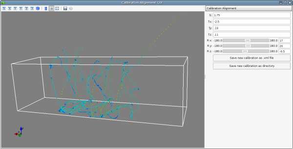
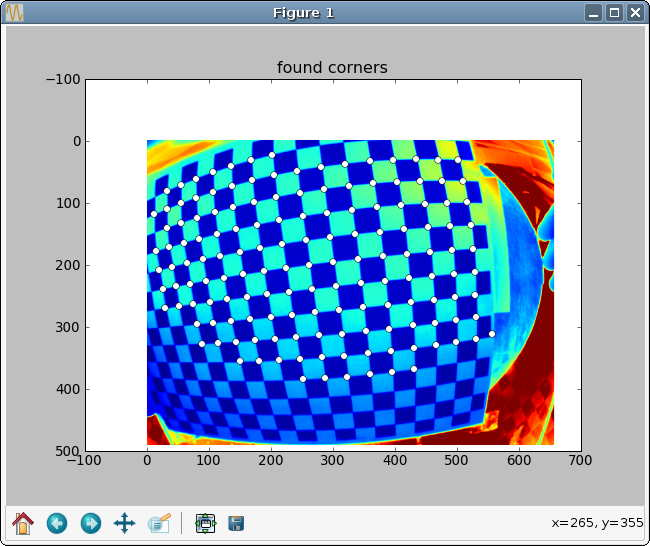
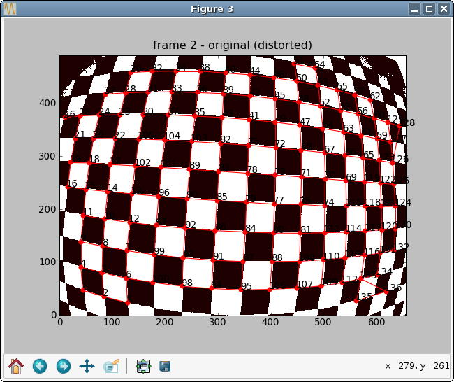
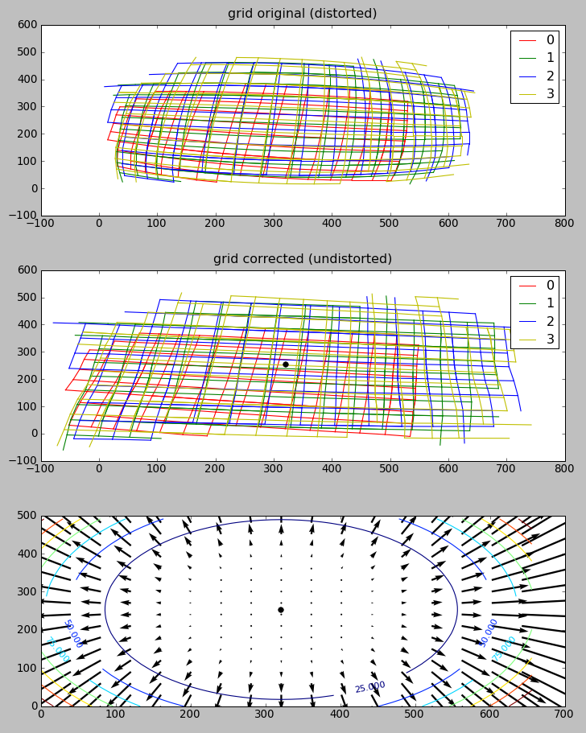
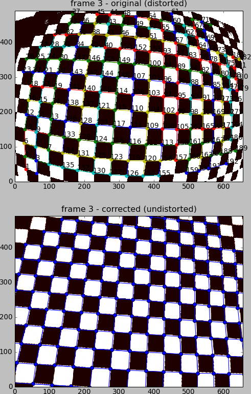

.. _calibration:

Calibration
===========

Flydra calibration data (also, in the flydra source code, a
*reconstructor*) consists of:

 * parameters for a *linear pinhole camera model* (including intrinsic
   and extrinsic calibration).

 * parameters for *non-linear distortion*.

 * (optional) a *scale factor* and *units* (e.g. 1000.0 and
   millimeters). If not specified these default to 1.0 and meters. If
   these are specified they specify how to convert the native units
   into meters (the scale factor) and the name of the present
   units. (Meters are the units used the dyanmic models, and otherwise
   have no significance.)

See :ref:`data_analysis-file_types-calibration_files` for a discussion
of the calibration file formats.

Generating a calibration using MultiCamSelfCal
==============================================

.. This was the old method numbered "2b".

The basic idea is that you will save raw 2D data points which are easy
to track and associate with a 3D object. Typically this is done by
waving an LED around.

For this to work, the 2D/3D data association problem must be
trivial. Only a single 3D point should be generating 2D points, and
every 2D point should come from the (only) 3D point. (Missing 2D
points are OK; occlusions *per se* do not cause problems, whereas
insufficient or false data associations do.)

(3D trajectories, which can only come from having a calibration and
solving the data association problem, will not be used for this step,
even if available. If a calibration has already been used to generate
Kalman state estimates, the results of this data association will be
ignored.)

Typically, about 500 points distributed throughout the tracking volume
will be needed for the MATLAB MultiCamSelfCal toolbox to complete
successfully. Usually, however, this will mean that you save many more
points and then sub-sample them later. See the
``config.cal.USE_NTH_FRAME`` parameter below.

Saving the calibration data in flydra_mainbrain
...............................................

Start saving data normally within the :command:`flydra_mainbrain`
application. Remember that only time points with more than 2 cameras
returning data will be useful, and that time points with more than 1
detected view per camera are useless.

Walk to the arena and wave the LED around. Make sure it covers the
entire tracking volume, and if possible, outside the tracking volume,
too.

Exporting the data for MultiCamSelfCal
......................................

Now, you have saved an .h5 file. To export the data from it for
calibration, run::

  flydra_analysis_generate_recalibration --2d-data DATAFILE2D.h5 \
    --disable-kalman-objs DATAFILE2D.h5

You should now have a new directory named
``DATAFILE2D.h5.recal``. This contains the raw calibration data
(synchronized 2D points for each camera) in a format that the MATLAB
MultiCamSelfCal can understand, the calibration directory.

.. _3d-recal:

Running MultiCamSelfCal
.......................

**NOTE: This section is out of date.** The new version of
MultiCamSelfCal does not require MATLAB and can be run purely with
Octave. The new version of MultiCamSelfCal is available from
https://github.com/strawlab/MultiCamSelfCal

Edit the file ``kookaburra/MultiCamSelfCal/CommonCfgAndIO/configdata.m``.

In the ``SETUP_NAME`` section, there a few variables you probably want
to examine:

 * In particular, set ``config.paths.data`` to the directory where
   your calibration data is. This is the output of the
   ``flydra_analysis_generate_recalibration`` command. Note: this must
   end in a slash (``/``).

 * ``config.cal.GLOBAL_ITER_THR`` is the criterion threshold
   reprojection error that all cameras must meet before terminating
   the global iteration loop. Something like 0.8 will be decent for an
   initial calibration (tracking an LED), but tracking tiny
   *Drosophila* should enable you to go to 0.3 or so (in other words,
   generating calibration data with the :ref:`3d-recal` method). To
   estimate the non-linear distortion (often not necessary), set this
   small enough that ``gocal`` runs non-linear parameter estimation at
   least once. This non-linear estimation step fits the radial
   distortion term.

 * ``config.cal.USE_NTH_FRAME`` if your calibration data set is too
   massive, reduce it with this variable. Typically, a successful
   calibration will have about 300-500 points being used in the final
   calibration. The number of points used will be displayed during the
   calibration step (For example, "437 points/frames have survived
   validations so far".)

 * ``config.files.idxcams`` should be set to ``[1:X]`` where ``X`` is
   the number of cameras you are using.

 * ``config.cal.UNDO_RADIAL`` should be set to 1 if you are providing
   a .rad file with non-linear distortion parameters.

The other files to consider are
``MultiCamSelfCal/CommonCfgAndIO/expname.m`` and
``kookaburra/MultiCamSelfCal/MultiCamSelfCal/BlueCLocal/SETUP_NAME.m``. The
first file returns a string that specifies the setup name, and
consequently the filename (written above as ``SETUP_NAME``) for the
second file.  This second file contains (approximate) camera positions
which are used to determine the rotation, translation, and scale
factors for the final camera calibration. The current dynamic models
operate in meters, while the flydra code automatically multiplies
post-calibration 3D coordinates by 1000 (thus, converting millimeters
to meters) unless a file named ``calibration_units.txt`` specifies the
units. Thus, unless you create this file, use millimeters for your
calibration units.

Run MATLAB (e.g. ``matlab -nodesktop -nojvm``). From the MATLAB
prompt::

  cd kookaburra/MultiCamSelfCal/MultiCamSelfCal/
  gocal

When the initial mean reprojection errors are displayed, numbers of 10
pixels or less bode pretty well for this calibration to converge. It
is rare, to get a good calibration when the first iteration has large
reprojection errors. Running on a fast computer (e.g. Core 2 Duo 2
GHz), a calibration shouldn't take more than 5 minutes before looking
pretty good if things are going well. Note that, for the first
calibration, it may not be particularly important to get a great
calibration because it will be redone due to the considerations listed
in :ref:`3d-recal`.

Advanced: automatic homography (alignment) using approximate camera positions
.............................................................................

Let's say your calibration had three cameras and you know their
approximate positions in world coordinates. You can automatically
compute the homography (rotate, scale, and translate) between your
original calibration and the new calibration such that the calibrated
camera positions will be maximally similar to the given approximate
positions.

Create a file called, e.g. ``align-cams.txt``. Each line contains the
3D coordinates of each camera. The order of the cameras must be the
same as in the calibration. Now, simply run::

  ``flydra_analysis_align_calibration --orig-reconstructor cal20110309a2.xml --align-cams align-cams.txt --output-xml``

The aligned calibration will be in ``ORIGINAL_RECONSTRUCTOR.aligned.xml``.

Advanced: using 3D trajectories to re-calibrate using MultiCamSelfCal
.....................................................................

.. This is the old method 2a.

Often, it is possible (and desirable) to make a higher precision
trajectory than that possible by waving an LED. For example, flying
*Drosophila* are smaller and therefore more precisely localized points
than an LED. Also, in setups in which cameras film through movable
transparent material, flies fly in the final experimental
configuration, which may have slightly different optics that should be
part of your final calibration.

By default, you enter previously-tracked trajectory ID numbers and the
2D data that comprised these trajectories are output.

This method also saves a directory with the raw data expected by the
Multi Camera Self Calibration Toolbox.

::

  # NOTE: if your 2D and 3D data are in one file,
  # don't use the "--2d-data" argument.
  flydra_analysis_generate_recalibration DATAFILE3D.h5 EFILE \
     --2d-data DATAFILE2D.h5
  # This will output a new calibration directory in
  # DATAFILE3D.h5.recal

The ``EFILE`` above should have the following format (for example)::

  # These are the obj_ids of traces to use.
  long_ids = [655, 646, 530, 714, 619, 288, 576, 645]
  # These are the obj_ids of traces not to use (exluded
  # from the list in long_ids)
  bad=[]

Finally, run the Multi Cam Self Calibration procedure on the new
calibration directory. Lower your threshold to, e.g.,
``config.cal.GLOBAL_ITER_THR = .4;``. You might want to adjust
``config.cal.USE_NTH_FRAME`` again to get the right number of data
points. This is a precise calibration, it might take as many as 30
iterations and 15 minutes.

Aligning a calibration
======================

Often, even if a calibration from MultiCamSelfCal creates
reprojections with minimal error and the relative camera positions
look OK, reconstructed world coordinates do not correspond with
desired world coordinates. To align the calibration the
:command:`flydra_analysis_calibration_align_gui` program may be used::

  flydra_analysis_calibration_align_gui DATAFILE3D.h5 --stim-xml=STIMULUS.xml

This results in a GUI that looks a bit like

Using the controls on the right, align your data such that it
corresponds with the 3D model loaded by STIMULUS.xml. When you are
satisfied, click either of the save buttons to save your newly-aligned
calibration.

Manually generating 3D points from images to use for alignment
..............................................................

You may want to precisely align some known 3D points. In this case the
procedure is:

1. Use :command:`flydra_analysis_plot_kalman_2d` to save a `points.h5`
   file with the 3D positions resulting from the original
   calibration. In particular, use the hotkeys as defined in
   :meth:`~flydra_analysis.a2.plot_kalman_2d.ShowIt.on_key_press`.

2. Load `points.h5` and a STIMULUS.xml file into
   :command:`flydra_analysis_calibration_align_gui` and adjust the
   homography parameters until the 3D locations are correct.

Estimating non-linear distortion parameters
===========================================

**The goal of estimating non-linear distortions is to find the image
warping such that images of real straight lines are straight in the
images.** There are two supported ways of estimating non-linear
distortion parameters.:

1. Using the `pinpoint GUI`_ to manually adjust the warping
   parameters.

2. Using :command:`flydra_checkerboard` to automatically estimate the
   parameters.

.. _pinpoint GUI: https://launchpad.net/pinpoint

Use of flydra_checkerboard
..........................

:command:`flydra_checkerboard` is a command-line program that
generates a .rad file suitable for use by MultiCamSelfCal and the
flydra tools (when included in a calibration directory).

The program is run with the name of a config file and possibly some
optional command-line arguments.

If everything goes well, it will::

1. Detect the checkerboard corners

2. Cluster these corners into nearly orthogonal multi-segment pieces.

3. Estimate the best non-linear distortion that fits this
   multi-segments paths as closely as possible to straight lines.

**The most important aspect of automatic corner detection is that
long, multi-segment paths are detected near the edges of the image.**

A minimal, but often sufficient, config file is given here. In this
case, this file is named `distorted2.cfg`::

  fname='distorted2.fmf' # The name of an .fmf movie with frames of a checkerboard
  frames= 0,1,2,3 # The frames to extract checkerboard corners from
  rad_fname = 'distorted2.rad' # The filename to save the results in.

.. keep flydra/radial_distortion/checkerboard up to date

A variety of other options exist::

  use = 'raw' # The image pre-processing algorithm to use before
              # extracting checkerboard corners. In order of preference, the options are:
              # 'raw'       - the raw image, exactly as-is
              # 'rawbinary' - a thresholded image
              # 'binary'    - a background-subtracted and thresholded image
              # 'no_bg'     - a background-subtracted image
  angle_precision_degrees=10.0 # Threshold angular difference between adjacent edges.
  aspect_ratio = 1.0           # Aspect ratio of pixel spacing (1.0 is normal,
                                                                0.5 is vertically downsampled)

  show_lines = False
  return_early = False
  debug_line_finding = False
  epsfcn = 1e09
  print_debug_info = False
  save_debug_images = False

  ftol=0.001
  xtol=0
  do_plot = False

  K13 = 320 # center guess X
  K23 = 240 # center guess Y

  kc1 = 0.0 # initial guess of radial distortion
  kc2 = 0.0 # initial guess of radial distortion

After adjusting these parameters, call
:command:`flydra_checkerboard`.

Critical to :command:`flydra_checkerboard` is the ability to extract
numerous checkerboard corners with few false positives. To ensure that
this is happens, here are a few command line options that help debug
the process::

  flydra_checkerboard distorted2.cfg --show-chessboard-finder-preview

The first image is a screenshot of the
`--show-chessboard-finder-preview` output when using the 'raw'
image. The detection of corners is good throughout most of the image,
but lacking particularly in the lower left corner. The second image
used the 'rawbinary' preprocessing mode. It appears to have detected
more points, which is good.

.. image:: images/chessboard_rawbinary_found_corners.jpg
  :width: 650
  :height: 546

**Finding the horizontal and vertical edges**

The next step is for :command:`flydra_checkerboard` to find the grid
of the chessboard. Run the folllowing command to see how well it does::

  flydra_checkerboard distorted2.cfg --find-and-show1

Here are two sample images this was performed on. In the first image,
we can see that the grid detection was very good, with no obvious
mistakes. In the second example, the grid detection had a couple
mistakes -- one in the lower right corner and one in the upper right
corner.

.. image:: images/chessboard_grid_no_mistakes.jpg
  :width: 650
  :height: 546

If everything looks good to this point, you may be interested in a
final check with the `--find-and-show2`, which identifies individual
paths. It is these paths that will be attempted to straighted in the
optimization procedure to follow.

To actually estimate the radial distortion, call the command with no
options::

  flydra_checkerboard distorted2.cfg

This will begin a gradient descent type optimization and will
hopefully return a set of good values. Note that you can seed the
starting values for the parameters with the K13, K23, kc1, and kc2
parameters described above. Over time you should see the error
decreasing, rapidly at first, and then more slowly.

Once the optimization is done, you may visualize the results. This
command reads the non-linear distortion terms from the .rad files::

  flydra_checkerboard distorted2.cfg  --view-results

This command reads all the files, re-finds the corners, and plots
several summary plots. **The most importart thing is that straight
lines look straight.** In the example images below, the distortion
estimation appears to have done a reasonably good job -- the
undistorted image has rather straight lines, and the "grid corrected"
panel appears to show mostly straight (although not perfect)
checkerboards.

