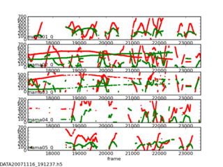

old Trac wiki page about Flydra
===============================

**This page was copied from the old Trac wiki page about Flydra and may have suffered some conversion issues.**

Flydra is heavily based on the motmot_ packages.

.. _motmot: http://code.astraw.com/projects/motmot

See Andrew's manuscript_ about flydra. Please send him any
comments/questions/feedback about the manuscript as he is planning on
submitting it.

.. _manuscript: http://www.its.caltech.edu/~astraw/publications/flydra.pdf

Subpages about flydra
---------------------

.. toctree::
  :maxdepth: 2

  network_setup.rst
  running_flydra.rst

Scripts of great interest
-------------------------

* |kdviewer| 3D viewer of Kalmanized trajectories saved in .h5 data
  file. (This is newer version of |plot_kalman_data| that uses TVTK.)

|mama_small_image|

* |flydra_kalmanize| re-analyze 2D data saved in .h5 data file using
  same Kalman filtering code as realtime analysis. Note: this will
  only run the causal Kalman filter, which allows re-segmenting the
  data into trajectories. However, another step, of running the
  non-causal smoothing algorithm, is typically desired. (See below for
  reasons why you might want to do this.)

* |flydra_analysis_generate_recalibration| save 2D data from a
  previously saved .h5 file to perform a (re-)calibration. This new
  calibration typically has very low reprojection errors. Performing
  this step can use either 3D trajectories in the .h5 file in order to
  solve the correspondence problem (which 2D points from which cameras
  correspond to the same 3D point). Alternatively, if only (at most) a
  single point is tracked per camera per time point, they are assumed
  to be from the same 3D point. In this case, specify a start and stop
  frame.

* ``ffpmeg`` for example ``ffmpeg -b 2008000 -f mpeg2video -r 25 -i
  image%05d.png movie.mpeg``

* |flydra_analysis_convert_to_mat| convert .h5 3D data to .mat for
  MATLAB; includes raw observations and realtime kalman filtered
  observations.

* |data2smoothed| convert .h5 3D data to .mat file for MATLAB;
  returns only results of 2nd pass kalman smoothing and timestamps

* |flydra_textlog2csv| save text log from .h5 file to CSV format (can
  be opened in Excel, for example)

.. |mama_small_image| image:: mama_small.png

.. |kdviewer| sourcelink:: flydra/a2/kdviewer.py
  :command: kdviewer

.. |plot_kalman_data| sourcelink:: flydra/analysis/flydra_analysis_plot_kalman_data.py

.. |flydra_kalmanize| sourcelink:: flydra/kalman/kalmanize.py
  :command: flydra_kalmanize

.. |flydra_analysis_generate_recalibration| sourcelink:: flydra/analysis/flydra_analysis_generate_recalibration.py
  :command: flydra_analysis_generate_recalibration

.. |flydra_analysis_convert_to_mat| sourcelink:: flydra/analysis/flydra_analysis_convert_to_mat.py
   :command: flydra_analysis_convert_to_mat

.. |data2smoothed| sourcelink:: flydra/a2/data2smoothed.py
  :command: data2smoothed

.. |flydra_textlog2csv| sourcelink:: flydra/a2/flydra_textlog2csv.py
  :command: flydra_textlog2csv

Scripts of lesser interest
--------------------------

* |flydra_analysis_filter_kalman_data.py| export a subset of the
  Kalmanized trajectories in an .h5 file to a new (smaller) .h5 file.

* |flydra_analysis_plot_kalman_2d.py| plot 2D data (x against y),
  including Kalmanized trajectories. (This is more-or-less the camera
  view.)

.. image:: plot_kalman_2d_small.png

* |plot_timeseries_2d_3d.py| plot 2D and 3D data against frame
  number. (This is a time series.)

* |plot_timeseries.py| plot 3D data against frame number. (This is a
  time series.)

* |flydra_images_export| export images from .h5 file.

.. |flydra_analysis_filter_kalman_data.py| sourcelink:: flydra/analysis/flydra_analysis_filter_kalman_data.py
  :command: flydra_analysis_filter_kalman_data.py

.. |flydra_analysis_plot_kalman_2d.py| sourcelink:: flydra/analysis/flydra_analysis_plot_kalman_2d.py
  :command: flydra_analysis_plot_kalman_2d.py

.. |plot_timeseries_2d_3d.py| sourcelink:: flydra/a2/plot_timeseries_2d_3d.py plot_timeseries_2d_3d.py
  :command: plot_timeseries_2d_3d.py

.. |plot_timeseries.py| sourcelink:: flydra/a2/plot_timeseries.py
  :command: plot_timeseries.py

.. |flydra_images_export| sourcelink:: flydra/a2/flydra_images_export.py
  :command: flydra_images_export

Reasons to run flydra_kalmanize on your data, even though it's already been Kalmanized
--------------------------------------------------------------------------------------

 * Re-running uses all the 2D data, including that which was
   originally dropped during realtime transmission to the mainbrain.
 * (If a time-budget for 3D calculations ever gets implemented, this
   running this will also bypass any time-budget based cuts.)
 * You have a new (better) calibration.
 * You have a new (better) set of Kalman parameters and model.

Image masking
-------------

Export camera views from the .h5 file::

  flydra_images_export DATA20080402_115551.h5

This should have saved files named cam_id.bmp,
(e.g. "cam1_0.bmp"). Open these in GIMP (the GNU image manipulation
program).

Add an alpha channel: open the Layers dialog (if it's not already
open). Right click on the layer (called "Background"), then select
"Add alpha channel".

Convert to RGB: Use the "Image" menu in the menubar:
"Image->Mode->RGB". (It would be nice if flydra supported grayscale
images in addition to RGB, but that's not yet implemented.)

Use the free select tool (like a lasso), to select the region you want
to ignore using the tool. Hints: You can select multiple areas by
holding down the 'shift' key. You can drag the lasso outside of the
image and it will just draw along the edge of the image. Next invert
the selection "Select->Invert" and cut the region you want to track
over (Ctrl-X).

The alpha channel may not have any values except 0 and 255, therefore if you
are not completely sure, use LAYERS/TRANSPARENCY/THRESHOLD ALPHA in Gimp to
create a clean alpha channel.

Here's an example of what you're looking for. The important point is
that you'll be tracking over the region where this image is
transparent.

.. image:: gimp_mask_example.png

Finally, "File->Save As..." and save as a .png file. The default
options are fine.

If you saved your file as "cam5_0_mask.png", you would use this with a
command like::

  flydra_camera_node --mask-images=cam5_0_mask.png

in a launch file, this would for example look like this::

    <node name="flydra_camera_node" pkg="ros_flydra" type="camnode" args="--num-buffers=100  --background-frame-alpha=0.01 --background-frame-interval=80 --num-points=6 --sleep-first=5 --mask-images=$(find flycave)/calibration/flycube1/oct_2013/Basler_21275576_mask.png:$(find flycave)/calibration/flycube1/oct_2013/Basler_21275577_mask.png:$(find flycave)/calibration/flycube1/oct_2013/Basler_21283674_mask.png:$(find flycave)/calibration/flycube1/oct_2013/Basler_21283677_mask.png:$(find flycave)/calibration/flycube1/oct_2013/Basler_21359437_mask.png" />

Watch out! The masks in the launch file (e.g. 'flydra.node' are in the OPPOSITE ORDER than the camera names in the .yaml file (e.g. 'flydra.yaml').
You can check this in the console output of the camnode::

    ----------------------------------------------------------------------------------------------------
    Camera guid ='Basler_21275577'
    has mask image: '/opt/ros/ros-flycave.electric.boost1.46/flycave/calibration/flycube1/oct_2013/Basler_21275577_mask.png'

Note that, as flydra_camera_node supports multiple cameras, you may
specify multiple mask images -- one for each camera. In these case,
they are separated by the (OS-specific) path separator. This is ':' on
linux.

Latency/performance of flydra
-----------------------------

Back in March 2007 or so, Andrew Straw measured the total latency of
flydra. At the time of writing (November 6, 2007) I remember the
shorter latencies to be approx. 55 msec. Most latencies were in this
range, but not being a hard-realtime system, some tended to be
longer. Most latencies, however were under 80 msec.

Today (November 6, 2007) I have done some more experimentation and
added some profiling options. Here's the breakdown of times:

 * 20 msec from the Basler A602f cameras. (This is a fundamental limit
   of 1394a, as it takes this long for the image to get to the host
   computer. 1394b or GigE cameras would help.)

 * 10 msec for local, 2D image processing and coordinate extraction on
   a 3.0 GHz Pentium 4 (w/HT) computer when ``flydra_camera_node``
   is using ``--num-points=3``.

 * 1 msec transmission delay to the Main Brain.

 * 15-30 msec for 3D tracking when ``flydra_camera_node`` is using
   ``--num-points=3``. (This drops to less than 10 msec with
   ``--num-points=1``.) This test was performed with an Intel Core 2
   Duo 6300 @ 1.86GHz as the Main Brain.

The values above add up roughly to the values I remember from earlier
in 2007, so I guess this is more-or-less what was happening back then.

As of Nov. 16, 2007, the ``check_atmel`` script was used to generate
this figure, which is total latency to reconstructed 3D on the
mainbrain with ``flydra_camera_node`` using ``--num-points=2``. This
includes the 20 msec Basler A602f latency, so presumably for GigE,
you'd subtract approx. 15 msec. Faster 2D camera computers would
probably knock off another 5 msec.

.. image:: overall_latency_20071115_baslerA602f.png

As of Feb. 20, 2008, the `LED_test_latency` script was used to test
total latency from LED on to UDP packets with position
information. This total latency was between 34-70 msec, with the 3D
reconstruction latency being from about 25-45 msec. Note that these
are from the initial onset of illumination, which may have different
amounts of latencies than ongoing tracking.

Profiling
---------

To profile the realtime Kalman filter code, first run the
``flydra_mainbrain`` app with the ``--save-profiling-data``
option. You will have to load the 3D calibration, synchronize the
cameras and begin tracking. The data sent to the Kalman tracker is
accummulated to RAM and saved to file when you quit the program. There
is no UI indication this is happening except when you finally quit it
will mention the filename. With the saved data file, run
|kalman_profile|. This will generate profiling output that can be
opened in kcachegrind.

.. |kalman_profile| sourcelink:: flydra/kalman/kalman_profile.py
  :command: kalman_profile.py

Flydra simulator
----------------

Option 1: Play FMFs through flydra_camera_node
~~~~~~~~~~~~~~~~~~~~~~~~~~~~~~~~~~~~~~~~~~~~~~

This approach requires pre-recorded .fmf files.

Run the mainbrain::

  REQUIRE_FLYDRA_TRIGGER=0 flydra_mainbrain

Now run an image server::

  flydra_camera_node --emulation-image-sources full_20080626_210454_mama01_0.fmf --wx

Option 2: Play .h5 file
~~~~~~~~~~~~~~~~~~~~~~~

This approach is not yet implemented.
