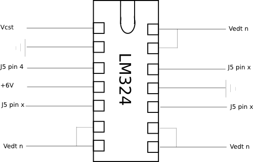

The Flydra Trigger Device
*************************

Overview
--------

The Flydra Trigger Device serves to provide a synchronized trigger
signal to all cameras providing input to the Main Brain. By use of a
custom trigger device, precise timing of frame-by-frame inputs can be
verified. (See the source of the
:command:`flydra_analysis_get_2D_image_latency` script for an
example.) Furthermore, additional experimental components can be
triggered by the device by use of the External Device Trigger.

Fundamentally, the device is a `Motmot CamTrig device`__ placed in a
custom enclosure with some minimal additional circuitry and custom
firmware.

__ http://code.astraw.com/projects/motmot/camtrig/OVERVIEW.html

The primary connections are A) the USB interface, which connects to
the Main Brain computer, and B) the Camera Sync Triggers, which
connects to the flydra cameras.

In addition the External Device Trigger, can be used to trigger
experimental devices via a software command from the Main Brain
computer over the USB interface.

Internal connection details
---------------------------

The Camera Sync Triggers are the bottom row of BNCs on the
device. Internally, they all share the same input. This is a direct
connection from the AT90USBKEY J5 pin 4 (and thus Port C6, OCR3A, of
the AT90USB1287). Optionally, an op-amp to provide a 5V trigger signal
may be added (see below).

External Device Trigger 1 is the top left BNC on the
device. Internally, this is a direct connection from the AT90USBKEY J5
pin 9 (and thus Port C1 of the AT90USB1287). Optionally, an op-amp to
provide a 5V trigger signal may be added (see below).

External Device Trigger 2: Internally, this is a direct connection
from the AT90USBKEY J5 pin 8 (and thus Port C2 of the
AT90USB1287). Optionally, an op-amp to provide a 5V trigger signal may
be added (see below).

External Device Trigger 3: Internally, this is a direct connection
from the AT90USBKEY J5 pin 7 (and thus Port C3 of the
AT90USB1287). Optionally, an op-amp to provide a 5V trigger signal may
be added (see below).

Optional 5V outputs
-------------------

An optional Op-Amp may be used to boost the output signal voltage from
3.3V to 5.0V and provide more current. Furthermore, it should provide
a degree of protection to the microcontroller from from adverse
connections.

In the drawing above, V\ :sub:`CST` are the Camera Sync Triggers, 
V\ :sub:`ETD n` are the External Device Triggers. J5 refers to the
jumper on the AT90USBKEY device. The resistors should be chosen to
give the appropriate gain. Values of 100 ohms for R1 and 200 ohms for
R2 will give a 3x gain, which will saturate the op-amp given a 6V
power supply and a 3.3V input from the AT90USB device. The +6 V power
is taken from an external power supply, which can be connected into
the trigger box via the provided plug.
