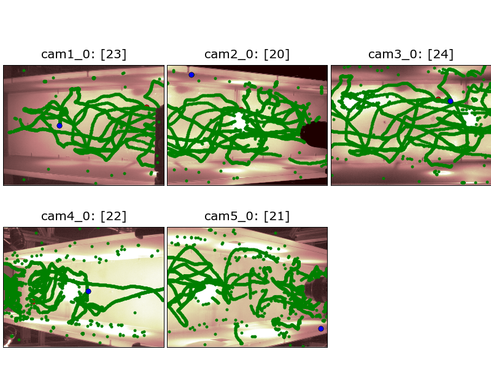
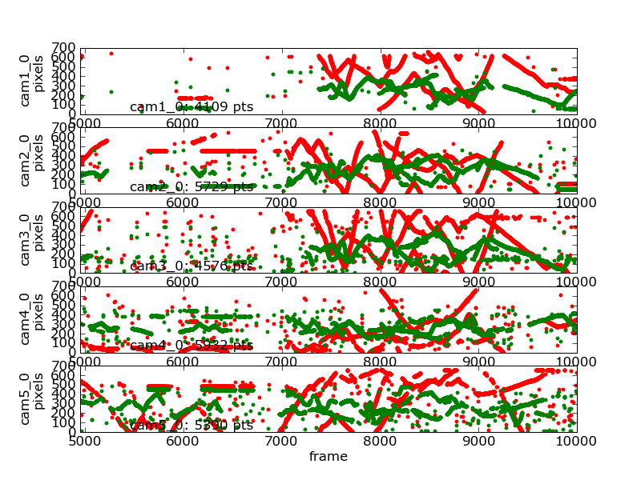
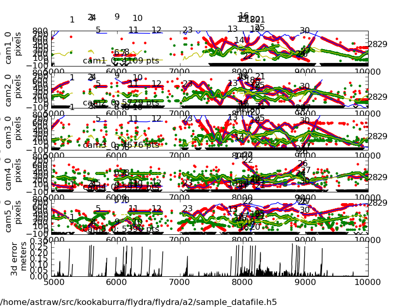

Gallery
*******

This page shows images that were automatically generated by the
command line tools installed with flydra. The command line used to
generate each figure is shown. These figures also serve as unit tests
for flydra -- the stored versions are compared with newly generated
versions whenever nosetests_ is run.

.. _nosetests: http://somethingaboutorange.com/mrl/projects/nose/

.. This file generated by flydra_test_commands --generate. EDITS WILL BE LOST.

Image gallery
=============

Camera view of 2D data
......................

The following command generated this image::

  flydra_analysis_plot_kalman_2d DATAFILE2D.h5 --save-fig=image.png

Timeseries of 2D data
.....................

The following command generated this image::

  flydra_analysis_plot_timeseries_2d_3d DATAFILE2D.h5 --save-fig=image.png \
       --hide-source-name

Timeseries of 2D and 3D data
............................

The following command generated this image::

  flydra_analysis_plot_timeseries_2d_3d DATAFILE2D.h5 \
       --kalman-file=DATAFILE3D.h5 --disable-kalman-smoothing \
       --save-fig=image.png --likely-only --hide-source-name

The ``--likely-only`` argument limits
the 2D data plotted.

Command gallery
===============

flydra_kalmanize
................

::

  flydra_kalmanize DATAFILE2D.h5 --reconstructor=CALIBRATION.xml --max-err=10.0 \
       --min-observations-to-save=10 --dest-file=DATAFILE2D.kalmanized.h5

This re-runs the data association algorithm. It
is useful to do this because the original realtime run may have
skipped some processing to meet realtime constraints or because a
better calibration is known. The new data are saved to an .h5 file
named ``DATAFILE2D.kalmanized.h5``.

flydra_analysis_data2smoothed
.............................

::

  flydra_analysis_data2smoothed DATAFILE3D.h5 --time-data=DATAFILE2D.h5 \
       --dest-file=DATAFILE3D_smoothed.mat

This produces a .mat file named
``DATAFILE3D_smoothed.mat``. This file contains smoothed tracking data in addition
to (unsmoothed) maximum likelihood position estimates.

