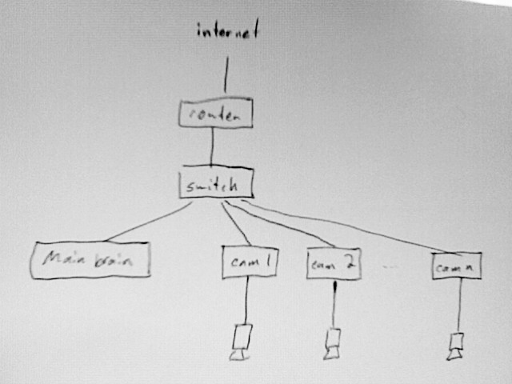

old Trac wiki page about Flydra Network Setup
=============================================

**This page was copied from the old Trac wiki page about Flydra and may have suffered some conversion issues.**

Network topology
----------------

Setup of openssh to allow public key based authentication
~~~~~~~~~~~~~~~~~~~~~~~~~~~~~~~~~~~~~~~~~~~~~~~~~~~~~~~~~

It is very handy to setup public-key based authentication -- many
fewer passwords to type! I can't find a simple-enough tutorial right
now.

(Note that host-based authentication is a real pain to setup.)

Specific to Prosilica cameras
~~~~~~~~~~~~~~~~~~~~~~~~~~~~~

The camera drivers (v 1.14 anyway) seem to have trouble unless the
camera is on eth0. Also, they suggest using Intel GigE network
adapters for the cameras. If the required port is not coming up as
eth0, you can force it in Ubuntu by adjusting the file
/etc/udev/rules.d/70-persistent-net.rules

.. image:: eth0_props.png

.. image:: network_settings.png
